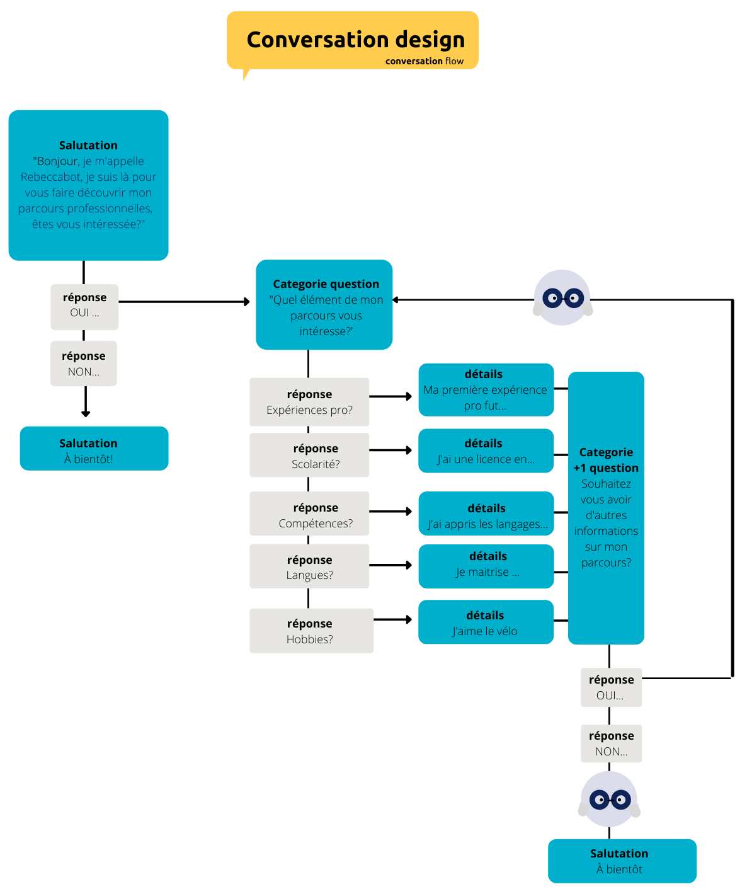

# 🚀 Chatbot
---

### Table of Contents

- [Description](#description)
- [How To Use](#how-to-use)
- [References](#references)
- [License](#license)
- [Contributor](#contributor)

---

## 📖 Description

This is a chatbot made in **Vanilla javascript** that can answer my Cv questions.

#### 🔬 Technologies

---

## How To Use

#### ⚙️ Installation

1. Installation of Nodejs

            sudo apt install nodejs

2. Initialisation of a package.json

            npm init

3. Installation of modules

            npm i jsdoc

#### 🔨 Conception of the chatbot

It is necessary to begin with a **chatbot flow**. This step will help you find the structure that will determines how the conversation will take place, taking into account the questions the chatbot would ask and the various replies that a user could provide.

      

## References

---

## License

---

## Contributors

- <spam>Kanu Rebecca</spam> [][github]
<!-- 
- <spam>Kanu Rebecca</spam> [][github] -->

 
 

[github]: https://github.com/RebeccaRamalho
